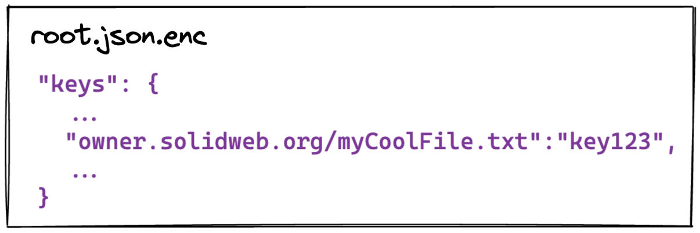

# Overview

Before the first encryption happens the user has to enter a master password. Using this password, all _file contents_ are end-to-end encrypted with individual encryption keys. Nobody, except the owner and people who received a sharing link can view the contents of any files. _Metadata_, like file names, is not encrypted or protected in any way.

Every file has its own encryption key. These are stored in "Keystores" which map file urls to corresponding encryption keys. The keystores are stored on the pod and are themselve encrypted with individual encryption keys. Only with the master password (or a shared link) one is able to decrypt them.

# Keystores

A user can have multiple keystores stored on their pod. The purpose of a keystore is, to contain the encryption keys for the files it is responsible for (e.g. it can be a dictionary that maps urls to keys). Each keystore is encrypted with an unique key.

To keep track of all keystores of a user, the file `/solidcrypt-data/keystores/keystores.json.enc` contains a list of all keystores, the url at which they are stored, and the key which is used to encrypt them. This file is encrypted with the master password.

Initially, there is only the "root" keystore, which contains all encryption keys for the files on the own pod. After sharing links, it also contains shared keystores. These contain the keys for all shared files and can also reside on different pods (e.g. when opening a link from a friend, the keystore will be on their pod).


# File Encryption

When a new file is created, a key is generated and stored in all keystores which contain this file (e.g. the root keystore for the own pod, or a shared keystore in a shared folder). The key is used to encrypt the file before it gets stored on the Solid Pod.


# File Decryption

When decrypting a file, all keystores are searched for the key. It takes the first key that is found and uses it to decrypt the file from the Solid pod.


# Sharing Links

There are two different aspects for sharing a resource. On the one hand, one has to grant permissions to access the file on the Solid pod (e.g. to allow GET and PUT requests). On the other hand, the encryption keys also have to be shared with the other user, so they are able to decrypt the resource.


## Granting permissions to the pod or what happens when sharing a link?

Let us assume there is a person called `owner` who would like to share their file `myCoolFile.txt`.


The mechanism is the same for all sharing types (read/write, file/folder). The idea is, to create a cryptographically random group in the form of `group-[randomKey].ttl`, which for illustrative purposes in our case will be `/groups/group-123randKeyUnguessable.ttl`.

Then we allow the public to read and append to this file.

> Read access is necessary since the server needs to check if somebody has the appropriate permissions for a resource

These permissions are set in the corresponding `group-123randKeyUnguessable.ttl.acl` file, which looks somewhat like this.


The `owner` (dark red) has full control over the group file while newly added `collaborators` (blue) can only read and append. At this point, the group is still just an empty file.

Then in our file's `.acl` file we need to give this group the desired permissions, so everyone who is a member of this group has the permissions we would like to grant our collaborators. Therefore, the `myCoolFile.txt.acl` looks somewhat like this:


As expected, the `owner` still has all rights (given that it is their file!) whereas the members of the `group` have been granted **read** and **write** access.

Finally, we need to retrieve the encryption key from our encrypted keystore to finalize the sharing link.


Now let us say that `owner` shares their file `myCoolFile.txt` with their two collaborators `alice` and `bob`. Then, upon opening the shared link which contains the secret group name, the collaborators add themselves to the group and our group file looks like this:


After adding themself to the group, they have access to the resource. The final link is made up of several components depending on if it is for a **file** or a **folder**. A shared link for a fale consists of a `file URL`, a `key` and the corresponding `group`

> ```
> [baseUrl]/share?file=owner.solidweb.org/myCoolFile.txt
> &key=key123
> &group=owner.solidweb.org/groups/group-123randKeyUnguessable.ttl
> ```

## Sharing encryption keys for files

The sharing link includes the encryption key for the file. This can be directly used to decrypt the file with the link.

## Sharing encryption keys for folders

Here we need to share keys for all files inside this folder (even those, which will be created in the future). This is done with a shared keystore for this folder.

When creating the link, the creator fetches all keys currently used in the folder and creates a new keystore with it. The keystore is encrypted with a new random key. The url to the key and the encryption key are added to the link. Both, the owner and the link receiver, add this keystore to their list of keystores.

Now, whenever a key for this folder is fetched, the keystore service will find the shared keystore and lookup the key there. When new files and keys are created, the keystore service also adds the key to the shared folder, so all users have access to the new file.

## Different kinds of keystores

We use different keystores for different purposes which will be explained briefly.


#### Root - `root.json.enc`

The root keystore stores the keys for all files in a person's own pod and is updated everytime a new file is created or uploaded.

```json
"keys": {
  ...
    "owner.solidweb.org/myCoolFile.txt":"key123",
  ...
}
```

#### Shared files - `shared-files.json.enc`

Stores the keys for every file that has been shared by another person and is updated when opening shared links.

```json
"keys": {
  ... 
  "otherPerson.solidweb.org/theirCoolFile.txt":"key567",
  ... 
}
```

#### Shared folders - `<random-id>.shared-keystore`

Stores the keys for all files inside a shared folder. It is created when creating a sharing link for the first time and update whenever new files are added inside the folder.

```json
"folderRoot" : "otherPerson.solidweb.org/theirFolder/"
"keys": {
  ... 
  "otherPerson.solidweb.org/theirFolder/file1.txt":"key567",
  "otherPerson.solidweb.org/theirFolder/file2.txt":"key345",
  ... 
}
```


#### Keystores - `keystores.json.enc`

A keystore for all your keystores. It stores the serialized metadata for other keystores and is updated whenever you add a new one.

```json
"keystores": [
    {
        "type": "folder",
        "keystoreSerialized": {
            "url": "root.json.enc"
        }
    "storageSerialized": {
            "encryptionKey": "key123"
        }
    },
    {
        "type": "sharedFile",
        "keystoreSerialized": {
            "url": "shared-files.json.enc"
        },
        "storageSerialized": {
            "encryptionKey": "keyABC"
        }
    },
    {
        "type": "sharedFolder",
        "keystoreSerialized": {
            "url": "root.json.enc",
            "root": "otherPerson.solidweb.org/theirFolder/"
        },
        "storageSerialized": {
            "encryptionKey": "keyABC"
        }
    },
]
```

Furthermore the keystores could be interpreted as a tree structure, with the **master key** being used to decrypt the `root.json.enc` which contains the keys to decrypt the `keystores.json.enc` which in turn contains the keys to the other keystores containing the keys to their respective files.
